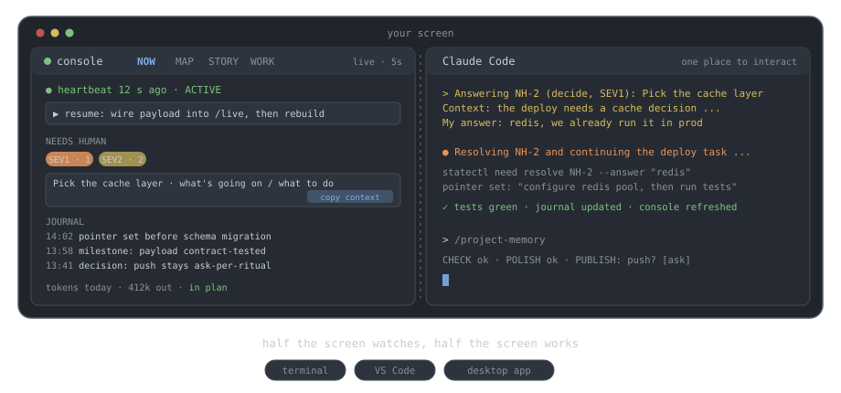

# dot-claude-iff · the Partner Guide

*The manual, and the learning path for collaborating with your agent.*

**[Repo](https://github.com/Sdamirsa/dot-claude-iff)** ·
**[Demo console](https://sdamirsa.github.io/dot-claude-iff/demo/console.html)** ·
**[Guided tour](https://sdamirsa.github.io/dot-claude-iff/)**

| You are | Start with |
|---|---|
| **A human partner** | [The daily shape](#the-daily-shape) (the half-screen habit), then [the five collaboration habits](#for-humans-how-to-collaborate-with-the-ai) - the whole learning path is ten minutes of reading and one session of practice. |
| **An agent** | [The three laws](#three-laws), the session ritual in `CLAUDE.md`, and [the commands](#commands). The protocols in `.claude/protocols/` are your contracts. |

---

A generalizable `.claude/` operating system for any project.

**One place to interact** (Claude Code) · **one place to control** (the console) · **one command
to evolve** (`/project-memory`) - on an always-on record, behind fail-closed gates.

Interact is human to system, control is system to human, evolve is system to itself. Three
surfaces, one place each. Observability and governance are the substrate underneath: the record
is what makes control truthful, the gates are what make interaction safe.

Everything lives in `.claude/`. A thing lives elsewhere **if and only if** it must, which is
what the name means.

## Install it into a project

Open Claude Code in the target project and say *adopt the claude-iff system*, or run `/adopt`
from a project already running it. Adoption inventories the target, asks a blocking round of
framing questions, installs with merge-never-overwrite, fills the placeholders, seeds the map
with spine layers only, dispatches the anatomist to fill in relations, builds the console, and
**probes that hooks actually fire** (project hooks require your trust first, so "silently off"
is a real state worth checking).

Requirements: `bash` and `python3`. That is the whole floor for the hooks and the six core
tools, forever. Project-registered steps and optional features may use `uv`.

## The daily shape



Works the same whether Claude Code runs in a terminal, in VS Code, or in the desktop app: give
the console one half of the screen and Claude Code the other.

The console is one HTML file with four tabs. It reads; it never writes. Where an action makes
sense, it hands you the exact command to paste, because a control surface that mutates state
behind your back is a second source of truth.

| Tab | What it answers |
|-----|-----------------|
| **NOW** | Is anything running, what is the resume pointer, what needs a human, what did the last turns do, what have we spent |
| **MAP** | What this system is made of, how the pieces relate, which layer each belongs to |
| **STORY** | How the project evolved, on a dual clock (wall time, or cumulative output tokens) |
| **WORK** | Active tasks and their next actions, the decision log, active watch-outs, research index |

Every panel says how fresh it is: `live` (heartbeat, journal, in-flight agents, queue) versus
`as of the last ritual` (map, story, curated summaries). The static file works offline over
`file://` as a labelled snapshot; `console.py` adds live polling on 127.0.0.1 only.

## Stable work blocks

The unit of collaboration here is a stable work block: a stretch of work that can survive an
interruption and be picked up cold, by anyone, human or AI. The system supplies the agent's
half of that harness: a pointer written to disk before anything risky, a journal that is the
source of truth, task checkpoints that name their done-evidence, handshake envelopes between
agents, and one ritual that seals each block. The console is how you watch a block without
interrupting it.

Communication is contractual in both directions. When the agent needs you, it must bring the
full situation: every needs-human item carries what is going on, why it matters, and the one
concrete thing to do, and the CLI refuses to open an item without them. The same bar applies
to you. The quality of the context you give is the quality of the block you get back.

## For humans: how to collaborate with the AI

Five habits. Each is short because the system does the heavy lifting; your part is precision.

**1 · Brief like a colleague, not a ticket.** Give the goal, the constraints, and what done looks
like. The difference:

```
Weak:   fix the login bug
Strong: Login fails for emails containing "+". Reproduce with
        tests/test_auth.py::test_plus_sign (currently failing). Do not touch
        the session middleware. Done means that test passes and the rest of
        the auth suite stays green.
```

**2 · Answer through the console.** When the queue has an item for you, press its "copy context"
button, paste into the Claude Code terminal, and type after `My answer:`. The agent receives
the full situation with your reply, so a two-word answer lands with nothing lost:

```
Answering NH-... (decide, SEV1): Pick the cache layer
Context: The deploy needs a cache decision; the wrong default doubles memory.
You asked me to: reply with redis or in-process
My answer: redis, we already run it in prod
```

**3 · Debug with evidence, not paraphrase.** Paste the actual output, the exact error, the failing
command. Say what you expected and what you saw. "It's broken" costs a round trip; a pasted
traceback usually costs none.

**4 · Correct once, then make it stick.** If you correct the same thing twice, say "log this as a
lesson". It becomes a row in `LESSONS.jsonl` with a mechanical prevention rule, and the agent
will cite it back before repeating the mistake. That is the system learning; feed it.

**5 · Close your blocks.** Run `/project-memory` at the end of a session, and answer gates when
asked; silence is not approval. An unclosed block is the one thing this system cannot protect.

## Get it into your own project

Grab a zip from the repo's **GitHub Releases** (built by CI from a tested tree), or from
`.claude/dist/` in a checkout - the same generator builds both, rebuilt by every ritual so
they can never go stale:

- **`dot-claude-iff-fresh.zip`**: for a NEW or empty repo. Unzip into the repo root, open
  Claude Code there, trust the hooks when asked, and follow the unzipped `START-HERE.md`.
- **`dot-claude-iff-adopt-kit.zip`**: for an EXISTING repo, with or without its own `.claude/`.
  Unzip anywhere OUTSIDE your repo, open Claude Code in your repo, and paste the one-line
  instruction from the kit's `ADOPT.md`. The agent follows the adopt skill; your existing
  files are merged, never overwritten.

## The one command

`/project-memory` runs four phases and is the only place derived surfaces are rebuilt.

- **CHECK** - does reality match the record? Journal parses, heartbeat present, generators
  fresh, cards lint, knobs registered, prices present, record size, queue synced, task
  checkpoints verified against disk. A failure stops the ritual before anything is published.
- **POLISH** - curate memory (log, lessons, status, tasks), then run *every* generator.
- **PUBLISH** - ingest token metadata, seal the record through the allowlist, roll up, anchor,
  commit, and push per policy (default: ask once).
- **EVOLVE** - a session digest goes to the retro-analyst, which proposes at most three
  evidence-backed changes; you confirm; the anatomist implements and updates the cards.

`--hard` turns it into a maturation session: full anatomy audit, a pruning sweep against actual
usage, task cards with pass-tests, and a decision list for you.

Why one command: in the system this was distilled from, the single regenerator that nobody
wired into the ritual sat frozen for two and a half months while everything downstream quietly
served stale data. So there is exactly one ritual, every generator is registered in
`.claude/config/memory.json`, and a lint checks they ran.

## Three laws

1. **Anti-rot.** A generator not registered in the ritual will rot. Freshness is decided by
   content hash, never mtime (git does not preserve mtimes; an mtime rule fires at random on
   every clone).
2. **Gates fail closed, telemetry fails open.** A broken validator blocks the write. A broken
   capture hook loses one event and nothing else. Both directions are deliberate.
3. **The record is radioactive.** Raw capture contains prompts, file contents and tool output
   verbatim (about 70% of capture volume, measured). It never enters git. It lives in a sibling
   folder outside the repo; only allowlisted metadata rollups and a tamper-evidence anchor are
   committed.

## Where things are

```
.claude/            the system: memory spine, protocols, skills, agents, hooks, config,
                    state, system-map, console, tools
.claude-iff/        committed record surface: anchor + redacted daily rollups (write-denied)
<parent>/<repo>_claude_iff/
                    RECORD_ROOT: raw capture, sealed raw (kept forever), segments,
                    transcripts, analysis products, vault snapshots
```

The record is a sibling folder rather than a hidden state directory so it stays visible and
inspectable next to the project it belongs to. Override it with `record_root` in
`.claude/config/policy.json`.

## Commands

```
python3 .claude/tools/statectl.py   pointer|task|milestone|decision|loop|note|need|refresh|resume
python3 .claude/tools/checkctl.py   run --phase check|polish|publish · probe · generators
python3 .claude/tools/obsctl.py     ingest|seal|rollup|anchor|report|story|size|analyze
python3 .claude/tools/mapctl.py     scan|lint|compile|show
python3 .claude/tools/consolectl.py build|payload|serve
python3 .claude/console/console.py                    # serve the console on 127.0.0.1
python3 .claude/tools/tests/run_tests.py              # the whole suite
```

The habit that matters most: **set the pointer before anything long or risky.**

```
python3 .claude/tools/statectl.py pointer "<the very next concrete action>"
```

A usage-limit cutoff or a crash mid-turn never fires the Stop hook, so the heartbeat cannot
save you. What survives is the sentence you wrote to disk before you started.

## Reading the record

Read it freely; it is plain JSONL. To analyse it, use the one sanctioned pathway, which batches
raw events to a separate model and writes labelled products into `analysis/`:

```
python3 .claude/tools/obsctl.py analyze --dry-run
```

Products reach the repo only by a human-gated copy into `.claude/research/`.

## Extending it

Don't, until the evidence says so. `.claude/protocols/evolution.md` sets the bar: at least two
occurrences or one concrete failure, at most three proposals per session, and the smallest
intervention that holds the fix (a CLAUDE.md line beats a rule beats a skill beats a
sub-agent). `NO-CHANGES` is a good outcome. Evolution also removes: unused components are
proposed for demotion or archival on the same evidence, never deleted.
