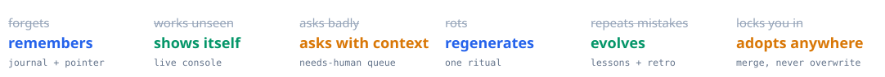
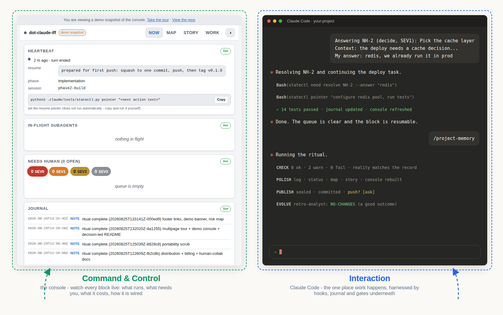

# dot-claude-iff

**What makes us human, built into Claude:** *adapt to context · evolve to challenge · communicate to partner.*

Agent sessions forget, work unseen, ask badly, and rot - so you re-explain context every
morning, catch problems three sessions late, and answer "should I?" with no situation attached.
**dot-claude-iff** is a `.claude/` operating system that fixes this at the mechanism level: it
harnesses the agent, records everything locally, and hands you one live page to command it all.



[](https://sdamirsa.github.io/dot-claude-iff/demo/console.html)

<p align="center">
  <a href="https://sdamirsa.github.io/dot-claude-iff/demo/console.html"></a>
  <a href="../../releases/latest"></a>
  <a href="https://sdamirsa.github.io/dot-claude-iff/"></a>
</p>

<p align="center">
  <a href="../.claude/README.md#for-humans-how-to-collaborate-with-the-ai"></a>
</p>

**Have an agent adopt it for you** - paste this to Claude Code (or any capable coding agent)
inside the repo you want it in:

```text
Clone https://github.com/Sdamirsa/dot-claude-iff to a sibling folder outside this repo, then
adopt its system into this repo by following the cloned repo's .claude/skills/adopt/SKILL.md
end to end. This repo may already have a .claude directory: merge, never overwrite, and report
every conflict to me before deciding.
```

---

<details>
<summary><b>The six decisions it is built on</b></summary>

**1 · Communication carries context, both ways.** The agent cannot open a question for you
without stating, in plain language, what is going on and what to do - the CLI refuses
otherwise. The console renders each question with a **copy context** button: you paste, type
your answer after `My answer:`, and the agent receives the full situation with your reply.

**2 · Memory is managed, not accumulated.** An append-only journal is the single source of
truth; everything readable is a projection rebuilt from it. Decisions land in a log, mistakes
become lessons with mechanical prevention rules, and a resume pointer is written to disk
*before* risky work - the one thing a crash cannot take from you.

**3 · Progress beats like a pulse.** A heartbeat marks every turn; hooks capture every event;
token usage is counted per model (and priced, or honestly marked "in plan" on a subscription).
The record's raw tier keeps verbatim history forever in a sibling folder **outside the repo** -
so `git push` structurally cannot publish a prompt, a file body, or a secret.

**4 · One command stops, publishes, learns, and evolves.** `/project-memory` runs four phases
under one transaction: **check** reality against the record, **polish** memory and rebuild
every derived surface, **publish** (seal, commit, ask before pushing), **evolve** - propose at
most three evidence-backed changes, which land only with your approval. Every generator runs
inside this ritual and nowhere else, so nothing can silently rot.

**5 · The system explains itself.** Every component has a card with curated relations,
compiled into a clickable map (click to trace connections, click again for details). An
anatomist agent keeps the cards true; a lint fails the ritual on a wrong edge.

**6 · Adoption is a merge, never a takeover.** The fresh zip seeds a new repo; the adopt kit
installs into an existing one - a pre-existing `.claude/` is the designed case, every conflict
is reported, and your version wins by default. Both zips are rebuilt by the ritual itself.

</details>

<details>
<summary><b>What it does, verb by verb</b></summary>

- **Records** every event into a local, append-only record - and phones home to no one.
- **Survives** interruptions: any session can be picked up cold, by anyone.
- **Shows** you everything on one live page: what runs, what needs you, what it costs, how the
  system is wired, and how the project evolved on a dual clock (wall time or tokens).
- **Asks** you properly, and carries your answers back with their context attached.
- **Closes** each work block with a single command, then **improves itself** only on evidence
  you approve - including *removing* what you never use.
- **Installs** into any repo - new or existing - and merges, never overwrites.

Runs on `bash`, `python3` and `git`. Installs nothing, imports nothing, sends nothing.

</details>

<details>
<summary><b>Trust posture and privacy</b></summary>

This system makes **zero network calls** - the one `urllib` site in the codebase is the opt-in
analysis engine, off by default, pointed only at an endpoint you configure (local Ollama keeps
even that on-machine). Claude Code itself talks to Anthropic exactly as it does without this
system; what this adds is a *local* record of what happened, and a mechanical guarantee that
nothing verbatim from that record can reach a commit - a CHECK gate even fails the build if a
committed file names your home directory.

Don't trust it - grep it: the
[tour's privacy section](https://sdamirsa.github.io/dot-claude-iff/understand.html) hands you
the verification commands and an annotated **risk map** of every file location and what is
safe to share.

</details>

<details>
<summary><b>Docs, manual, and deeper reading</b></summary>

- **[The Partner Guide](../.claude/README.md)** - the manual and the human-collaboration
  learning path: the daily shape, the three laws, the five habits, every command. Lives inside
  `.claude/` so agents read the same document you do.
- **[The guided tour](https://sdamirsa.github.io/dot-claude-iff/)** - ten pages with progress
  tracking: understand (with the privacy risk map), set up, six hands-on exercises.
- **[The protocols](../.claude/protocols)** - handshake, human gates, honesty, evolution.
- **[The design contract](../.claude/research/2026-08-24-system-design.md)** - how this was
  distilled from two source systems, and the eight settled decisions.

</details>

<details>
<summary><b>Contribute back</b></summary>

**[⭐ Star](../../stargazers)** the repo to say the ideas earned it.
**[🐛 Open an issue](../../issues/new)** when something is wrong, unclear, or missing - and
hold it to this system's own communication contract: say what is going on, why it matters, and
the one concrete thing you are asking for. That is exactly how the agents here are required to
ask *you*.

</details>

<details>
<summary><b>The five habits of a good partner</b></summary>

The agent's half of collaboration is built in; these five are yours. Full versions with
examples live in [the Partner Guide](../.claude/README.md#for-humans-how-to-collaborate-with-the-ai).

1. **Brief like a colleague, not a ticket.** Give the goal, the constraints, and what done
   looks like - "fix the login bug" costs a round trip that a failing test name does not.
2. **Answer through the console.** Press an item's "copy context" button, paste, and type
   after `My answer:` - a two-word reply lands with the full situation attached.
3. **Debug with evidence, not paraphrase.** Paste the actual output and the exact error; say
   expected versus observed.
4. **Correct once, then make it stick.** Say "log this as a lesson" and the mistake becomes a
   mechanical prevention rule the agent cites before repeating it.
5. **Close your blocks.** Run `/project-memory` at the end of a session; answer gates when
   asked - silence is not approval.

</details>


---

<p align="center"><i>"We rise by lifting others."</i><br><i>"Good unite hearts, cover all, break none."</i></p>
